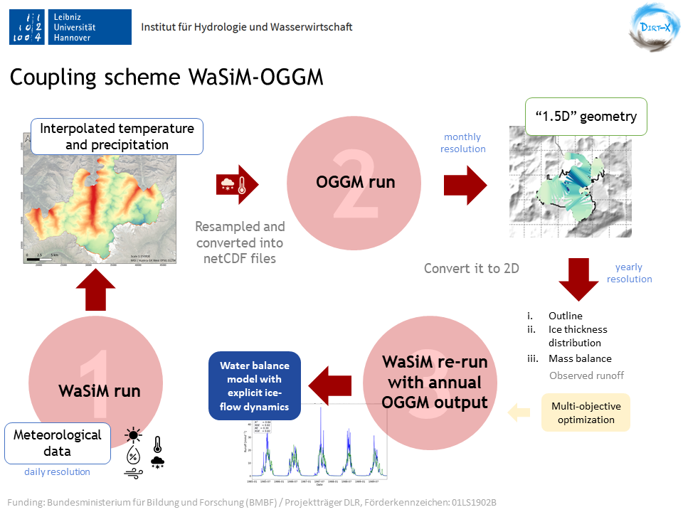

# WaSiM-OGGM

The water balance in high glacierized regions is greatly influenced by the glacier's behavior, since they can alter the hydrological response of a catchment across time scales.
Although some water balance models (i.e. **WaSiM**) can satisfactory estimate glacier's evolution by using empirical approachs, a representation of the explicit ice thickness is still missing. Therefore, a coupling scheme between **WaSiM** and a more sophisticated glacier model that accounts for glacier geometry including explicit ice flow dynamics is developed (more specifically, **OGGM** is used). 
Since only the water balance model is calibrated, no additional expertise on glacier modelling is required from the user. This coupling scheme could serve as a tool to predict the hydrological response of any glacierized catchment under different climate projections in the future.

### About the models
The **Wa**ter Flow and Balance **Si**mulation **M**odel ([**WaSiM**](http://www.wasim.ch/en/index.html), Schulla (1997, 2021)) is a grid-based model used for the simulation of the hydrological processes above and below the land surface. Current version: Richard's model version 10.06.04. 

The **O**pen **G**lobal **G**lacier **M**odel ([**OGGM**](https://oggm.org/), (Maussion et al., 2019)) is a modular open source model for glacier dynamics. Current version: v1.6.

### Requirements
Linux or Mac is required for running OGGM.

### Get in touch
María Herminia Pesci, MSc. pesci@iww.uni-hannover.de

### About

This coupling scheme is developed by the Institute of Hydrology and Water Resources Management, Leibniz University Hannover (Germany)
and is part of the project DIRT-X, which is part of AXIS, an ERA-NET initiated by JPI Climate, and funded by FFG Austria, BMBF Germany (FKZ: 01LS1902B),
FORMAS Sweden, NWO NL, RCN Norway with co-funding by the European Union (Grant No. 776608).

 
