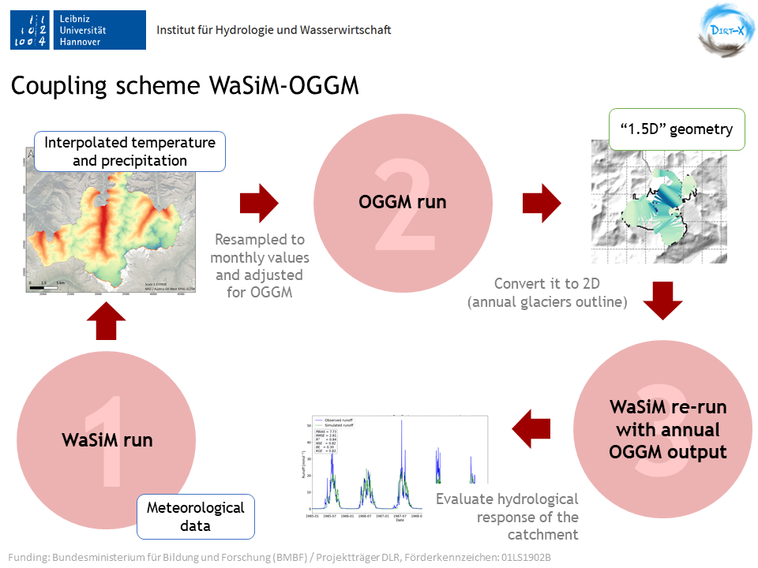

# WaSiM-OGGM
WaSiM-OGGM is an open-source coupling scheme between:
- WaSiM ==> Water Flow and Balance Simulation Model developed by Schulla, J. (1996)
- OGGM ==> Open Global Glacier Model for glacier dynamics developed by Maussion, F. et al (2019)

### About the models

Current versions:
WaSiM Richard's model version 10.06.04 \\
OGGM v1.5.2

This coupling scheme is developed by the Institute of Hydrology and Water Resources Management, Leibniz University Hannover (Germany)
and is part of the project DIRT-X, which is part of AXIS, an ERA-NET initiated by JPI Climate, and funded by FFG Austria, BMBF Germany,
FORMAS Sweden, NWO NL, RCN Norway with co-funding by the European Union (Grant No. 776608).
